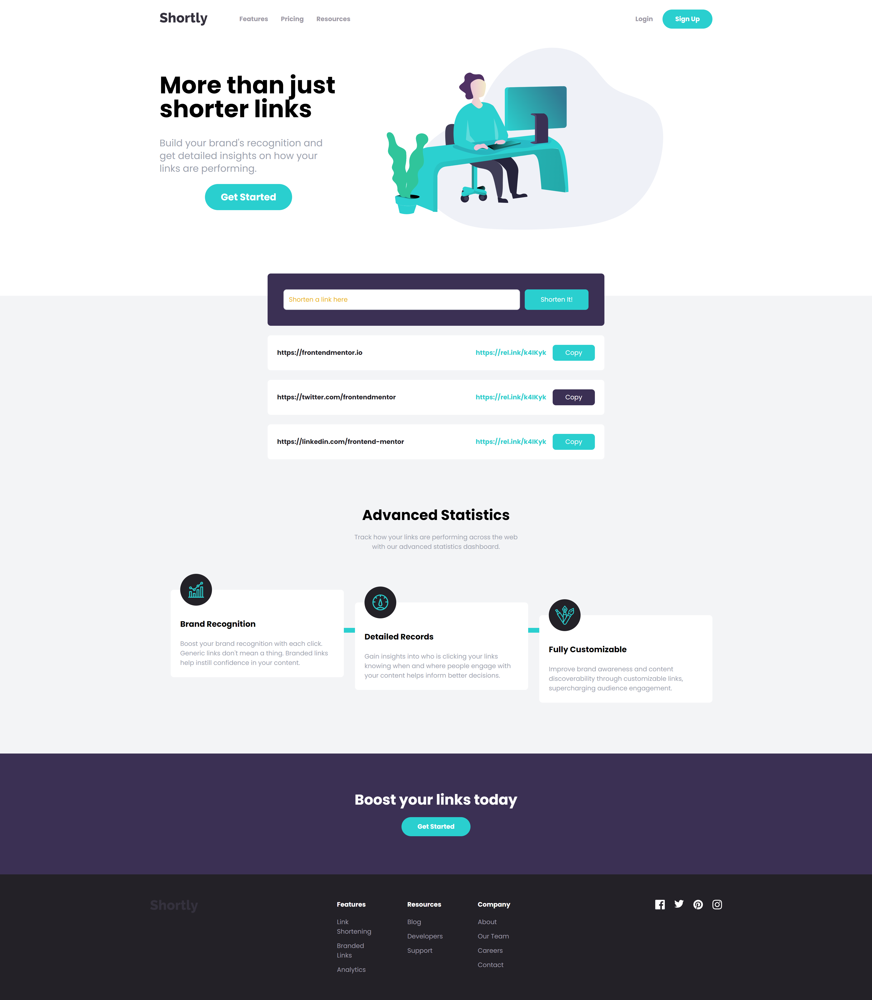

# ShortlyTraining

This README provides an overview of the `index.html` file for the ShortlyTraining project, focusing on the Tailwind CSS classes and functionality used throughout the document. The file is structured into several key sections, each utilizing various Tailwind utilities to create a responsive and visually appealing layout.

## Table of Contents
1. [Hero Section](#hero-section)
2. [Features Section](#features-section)
3. [CTA Section](#cta-section)
4. [Footer Section](#footer-section)

## Hero Section

The hero section serves as the introduction to the page, featuring a welcoming message and a call-to-action.

### Key Tailwind Classes:
- **Container**: `max-w-6xl mx-auto px-6 py-12` - Centers the content and applies padding.
- **Text Styling**: `text-4xl font-bold` - Sets a large, bold font for emphasis.
- **Responsive Layout**: `flex flex-col md:flex-row` - Adjusts the layout based on screen size.

## Features Section

This section highlights the key features of the product with supporting text and icons.

### Key Tailwind Classes:
- **Grid System**: `grid grid-cols-1 md:grid-cols-3 gap-6` - Creates a responsive grid layout with equal spacing.
- **Text Centering**: `text-center` - Centers the text within each grid item.
- **Background Color**: `bg-gray-100` - Applies a light gray background to enhance readability.

## CTA Section

The call-to-action section encourages users to take specific actions, such as signing up or learning more.

### Key Tailwind Classes:
- **Text Styling**: `text-2xl font-semibold` - Highlights the importance of the call to action.
- **Button Styles**: `bg-blue-500 text-white rounded-lg px-4 py-2` - Styles the button with color and padding for a modern look.

## Footer Section

The footer concludes the page with additional navigation and copyright information.

### Key Tailwind Classes:
- **Background Color**: `bg-black` - Sets the footer background color to black for contrast.
- **Flex Utilities**: `flex justify-between items-center` - Arranges the footer content horizontally and aligns it properly.
- **Text Color**: `text-gray-500` - Applies a light gray color to footer text for readability.

