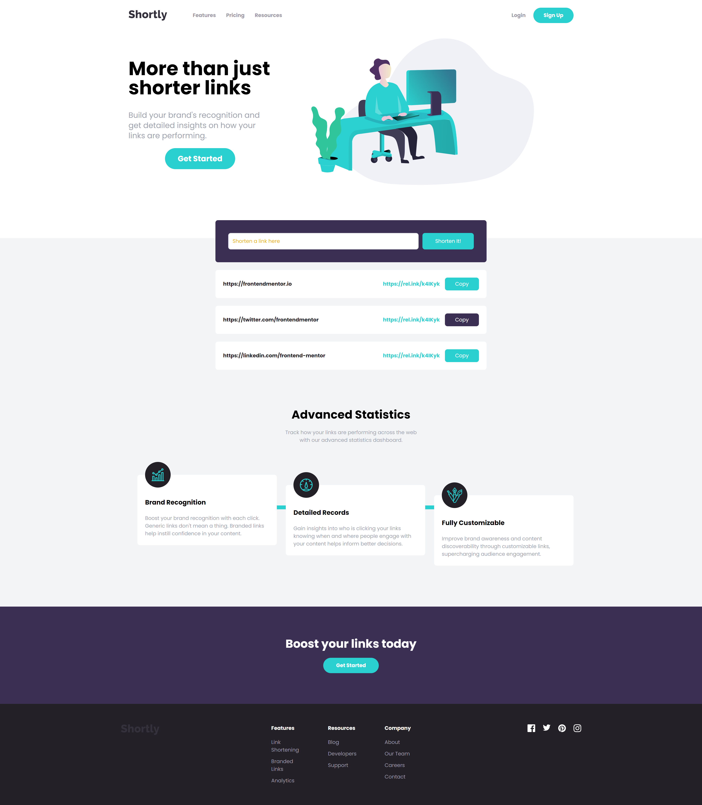

# ShortlyTraining

Este README fornece uma visão geral do arquivo `index.html` para o projeto ShortlyTraining, focando nas classes Tailwind CSS e na funcionalidade usadas ao longo do documento. O arquivo é estruturado em várias seções principais, cada uma utilizando várias utilidades do Tailwind para criar um layout responsivo e visualmente atraente.

## Tabela de Conteúdos
1. [Hero Section](#hero-section)
2. [Features Section](#features-section)
3. [CTA Section](#cta-section)
4. [Footer Section](#footer-section)

## Hero Section

A seção hero serve como a introdução à página, apresentando uma mensagem de boas-vindas e uma chamada à ação.

### Principais Classes Tailwind:
- **Container**: `max-w-6xl mx-auto px-6 py-12` - Centraliza o conteúdo e aplica padding.
- **Estilização de Texto**: `text-4xl font-bold` - Define uma fonte grande e em negrito para ênfase.
- **Layout Responsivo**: `flex flex-col md:flex-row` - Ajusta o layout com base no tamanho da tela.

## Features Section

Esta seção destaca as principais funcionalidades do produto com texto de apoio e ícones.

### Principais Classes Tailwind:
- **Sistema de Grid**: `grid grid-cols-1 md:grid-cols-3 gap-6` - Cria um layout de grid responsivo com espaçamento igual.
- **Centralização de Texto**: `text-center` - Centraliza o texto dentro de cada item do grid.
- **Cor de Fundo**: `bg-gray-100` - Aplica um fundo cinza claro para melhorar a legibilidade.

## CTA Section

A seção de chamada à ação incentiva os usuários a realizarem ações específicas, como se inscrever ou saber mais.

### Principais Classes Tailwind:
- **Estilização de Texto**: `text-2xl font-semibold` - Destaca a importância da chamada à ação.
- **Estilos de Botão**: `bg-blue-500 text-white rounded-lg px-4 py-2` - Estiliza o botão com cor e padding para um visual moderno.

## Footer Section

O rodapé conclui a página com navegação adicional e informações de copyright.

### Principais Classes Tailwind:
- **Cor de Fundo**: `bg-black` - Define a cor de fundo do rodapé como preta para contraste.
- **Utilitários Flexíveis**: `flex justify-between items-center` - Organiza o conteúdo do rodapé horizontalmente e o alinha corretamente.
- **Cor do Texto**: `text-gray-500` - Aplica uma cor cinza claro ao texto do rodapé para legibilidade.
